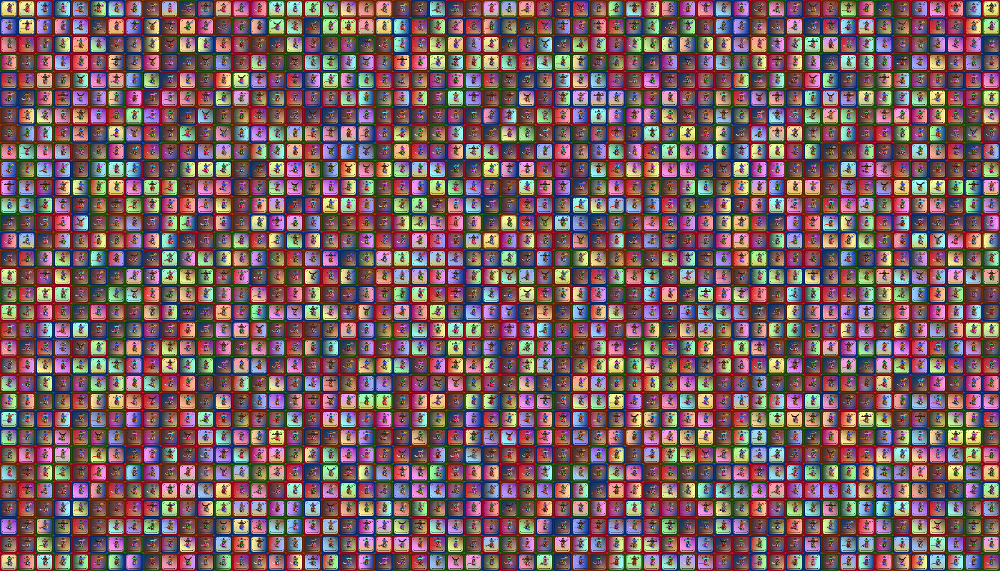
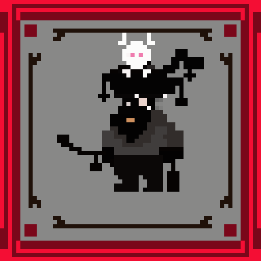
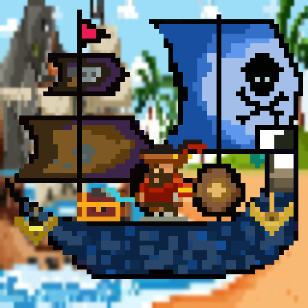

## The Pirate NFT Club
Pirate NFT Club is a project by two people, Uma and Sowmya. We think of this club as a place to learn how to create and mint ERC721 NFTs. Learn how to stake your NFTs and how to bring your NFTs to the metaverse. We will soon be launching a collection of tools to simplify the process of NFT creation and minting. Finally, we will launch a P2E game where you can use the PirateNFTClub NFTs to play, earn and trade NFTs.

-

We will be posting regular project updates on this site soon.

## Coming soon:
-DAPP for our NFTS
-Metaverse Game: Need pirateNFTClub NFTs to play

## Why should you buy our NFTs
- Our NFTs are not just collectibles, they can be used in the P2E game we will be launching
- We will be launching tools and utilities for NFT minting, owners of our NFTs will have unlimited access to resources and other exclusive benefits.

### Our Pirate NFTs
We are launching our NFTs on Opensea: [PirateNFTClub](https://opensea.io/PirateNFTClub)

#### PirateCaptains
We will be launching a collection of 15,555 pirate captains on Feb 28th, 2022. Date of auction will be revelaed soon.

Each captain NFT is created using one of the unique features:
- A pirate Hat
- A pirate Vest
- Pirate pants
- Weapon: grenade, bomb, sword, spikes, etc
- Face: Grey face with a pipe, red face with mustache
- Hairstyle: mohawk, bald, etc
- Unique card background: Green , blue, red, etc

-

#### PirateShips
We will be launching a collection of 11,111 pirate ship NFTs. Each ship has the following features:
- Ship Hull
- Ship Captain
- Ship Anchor
- Ship Cannons
- Ship Head Sail
- Ship Main Sail
- Ship Treasures
- Ship Rum Barrels
- Pirate Island

The rare Ships are charecterized by:
- Three big cannons
- Blue faced captain
- Captain Cabin with a Cannon

### Peek-a-booo
Some sample NFTs that will be available:
- 
- 

