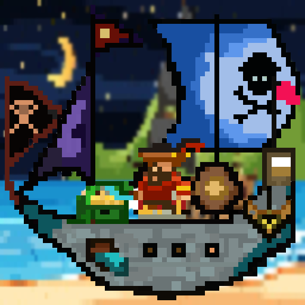

## The Pirate NFT Club
Pirate NFT Club is a project by two people, Uma and Sowmya. We think of this club as a place to learn how to create and mint ERC1721 NFTs. Learn how to stake your NFTs and how to bring your NFTs to the metaverse.

### Our Pirate NFTs
We are launching our NFTs on Opensea: [PirateNFTClub](https://opensea.io/PirateNFTClub)

#### PirateCaptains
We will be launching a collection of 10,000 pirate captains.

Each captain comes with:
- Hat
- Feather
- Vest
- Pant
- Sword
- Ribbons
- Face

#### PirateShips
We will be launching a collection of 11,111 pirate ship NFTs. Each ship has the following features:
- Ship Hull
- Ship Captain
- Ship Anchor
- Ship Cannons
- Ship Head Sail
- Ship Main Sail
- Ship Treasures
- Ship Rum Barrels
- Pirate Island

The rare Ships are charecterized by:
- Three big cannons
- Blue faced captain
- Captain Cabin with a Cannon

### Peek-a-booo
Some sample NFTs that will be available:
- 
- 

